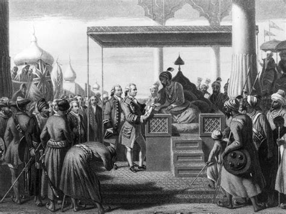

# The History of the Commonwealth: A Timeline

The Commonwealth of Nations has evolved from the British Empire into a modern association of independent nations. This timeline traces the key moments in Commonwealth history based on the texts we studied in class.

---

## 🏭 **Early Colonial Expansion (Texts A, B, E)**

The foundation of the Commonwealth began with British colonial expansion:

**British East India Company:** The company established trading posts across Asia and eventually governed territories in India, representing British commercial and political interests abroad.

**India (Text A):** The British East India Company evolved from trading posts to governing territories, collecting taxes and running courts. What began as business slowly became government.

**Australia (Text B):** Initially a penal colony, Australia developed into a permanent settlement with its own identity while maintaining ties to Britain. This expansion had profound effects on Aboriginal peoples.

**Africa (Text E):** European powers, including Britain, divided Africa at conferences, drawing borders with little regard for local societies and establishing colonial administrations.

---

## 🏛️ **1867 - Confederation of Canada (Text D)**

Separate colonies in North America decide to join together to form a single federal country called Canada. This creates the first "dominion" - a new type of relationship between Britain and its colonies.

**Key Features:**
- Federal system with shared responsibilities between national and local governments
- National institutions: parliament, courts, postal routes, and railways
- Growing sense of shared identity as citizens of one country
- Balance between local languages/customs and national unity

**Significance:** Canada became the model for other dominions, showing how colonies could unite while maintaining ties to Britain.

---

## 📜 **1926-1931 - Path to Dominion Status (Text H)**

The British Parliament recognizes that Dominions like Canada, Australia, and New Zealand can make their own laws without needing approval from London.

**Key Changes:**
- Dominions gained authority to govern themselves in internal matters
- Local parliaments gained real legislative power
- Major step toward full political independence
- Some matters like foreign policy still coordinated with Britain

**Impact:** This legal change made political life more meaningful in the dominions, as elections and debates now had real consequences.

---

## ⚖️ **1833 - Abolition of Slavery (Text C)**
](./Abolition-of-Slavery-Act-e1602673676628.jpg)

Britain's parliament passes a law making slavery illegal across its possessions, including Caribbean colonies like Jamaica and Barbados.

**Consequences:**
- End of the official system of buying and selling people as property
- Forced changes in plantation operations and colonial economies
- Former owners received government compensation
- Long process of social and economic transformation began

**Legacy:** This marked a public rejection of slavery and started moral transformation across the Empire.

---

## 🌍 **1947-1949 - Indian Independence and the London Declaration (Texts I, J)**

**Indian Independence (Text I):** After a long campaign for self-rule, new independent states are formed: India and Pakistan. This process involved massive population movements and the challenge of building new nations.

**Commonwealth Transformation (Text J):** Leaders agree to transform the old imperial relationship into a voluntary association. The key innovation: countries can become republics and still remain members.

**New Commonwealth Features:**
- Cooperation in education, health, trade, sport, and culture
- Shared values and common language links
- Programs to help smaller nations with training and development
- Networks that last beyond formal political control

---

## 🌍 **1899-1902 - The South African War (Text F)**

A violent conflict erupts between the British Empire and the Boer republics (Transvaal and Orange Free State).

**Impact:**
- Disrupted farming and forced civilians into camps
- Introduced modern military methods to the region
- Families lost homes and communities were displaced
- Political map was redrawn after British victory

**Aftermath:** This conflict led to the reorganization of land ownership and local government, setting the stage for future political developments.

---

## 🤝 **1910 - Union of South Africa (Text G)**

Several British colonies and Boer territories agree to form the Union of South Africa.

**Key Features:**
- Central government with national courts and common legal system
- Symbolic links to Britain but internal self-governance
- National railways, services, and civil service
- Citizens participate in national elections

**Challenge:** The union embedded inequalities that would shape later political struggles, including the development of apartheid.

---

## 🏴 **1956 - The Suez Crisis (Text K)**

A dramatic confrontation over the Suez Canal shows the limits of old imperial power.

**Events:**
- Britain and France, with Israel, try to regain control of the canal
- International pressure forces withdrawal
- Episode damages the international standing of involved governments

**Significance:** This crisis demonstrated that military intervention was no longer an effective instrument of national policy and marked the end of traditional imperial power projection.

---

## 🆓 **1957 - Ghana's Independence (Text L)**

Ghana (formerly the Gold Coast) becomes the first African territory to achieve independence, inspiring other African nations.

**Significance:**
- First African country to join the Commonwealth as an independent nation
- Demonstrated that peaceful political change was possible
- Leaders focused on building schools, hospitals, and national economy
- Joined Commonwealth for scholarships, trade links, and diplomatic support

**Impact:** Ghana's independence signaled the beginning of African decolonization.

---

## 🌊 **1960s - Wave of African Independence (Text M)**

A wave of independence spreads across Africa as many territories move from colonial rule to self-governance.

**Challenges for New Nations:**
- Building stable institutions
- Creating economic plans
- Dealing with border disputes from colonial map-drawing
- Balancing local traditions with modern statehood demands

**Changes:** Trade patterns shifted, new embassies opened, and international organizations received many new members.

---

## 🚫 **Apartheid Era - South Africa's Isolation (Text N)**

South Africa's apartheid system leads to international isolation and internal resistance.

**Consequences:**
- Many countries reduce diplomatic and sporting ties
- Trade, travel, and cultural exchange become limited
- Internal resistance grows through protests and campaigns
- International pressure contributes to eventual political transformation

**Lesson:** This period shows how the Commonwealth's values of equality and human rights became central to membership.

---

## 🔄 **Commonwealth Today - A Voluntary Association**

The modern Commonwealth, born from the transformation described in Text J, represents:

### **54 Member Nations** united by:
- Shared values: democracy, human rights, rule of law
- Common language and legal traditions
- Voluntary cooperation in education, health, trade, and sport
- Networks that support development and cultural exchange

### **Key Principles:**
- **Voluntary membership** - countries choose to join and remain
- **Equality** - regardless of size or wealth
- **Cooperation** - not control
- **Respect for sovereignty** - each nation governs itself

---

