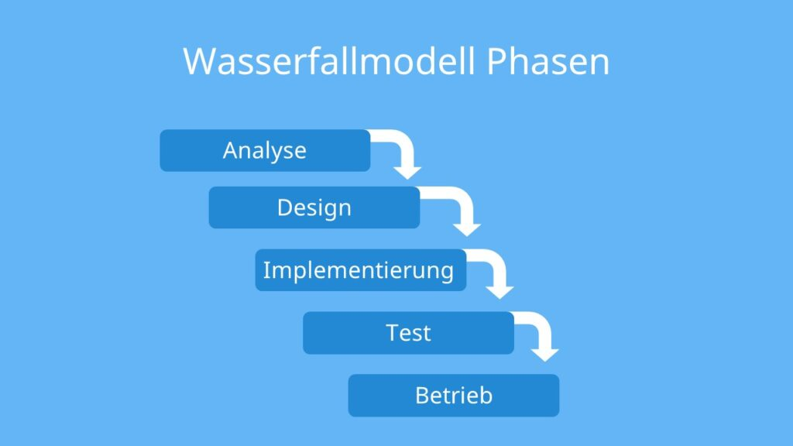
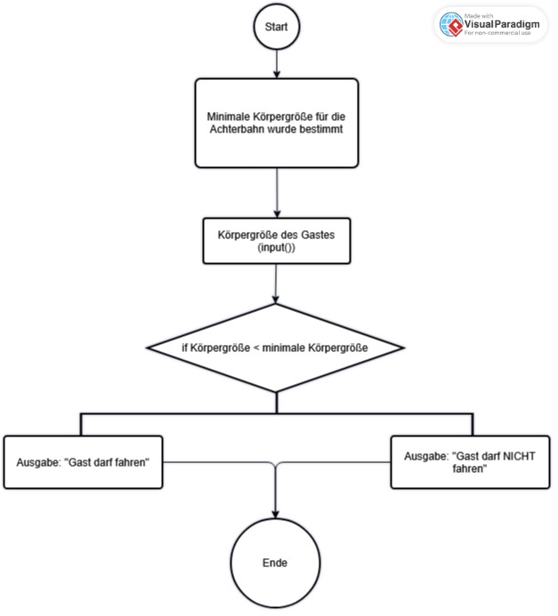

## Erläuterung

Das Wasserfallmodell stammt ursprünglich aus dem Projektmanagement. Mit Hilfe des Wasserfallmodells lassen sich Aufgaben in kleinere Schritte unterteilen, die man besser abarbeiten kann. Dieses Prinzip große Aufgaben vor der Bearbeitung in kleinere zu unterteilen nennt man auch **Teile-und-Herrsche** (Divide-and-Conquer).



Die **5 Phasen** des Wasserfallmodells werden von oben nach unten abgearbeitet. Klar, ein Wasserfall fließt ja schließlich von oben nach unten. Die Idee ist dabei, dass man *nicht* in eine bereits abgeschlossene Phase zurückspringen kann. Einmal abgeschlossen geht es weiter mit der nächsten.

# Phasen

1. Analyse: Anforderungen analysieren
2. Design: Entwurf erstellen
3. Implementierung: Entwurf umsetzen
4. Test: Test durchführen
5. Betrieb: In Betrieb nehmen

# Erklärung am Beispiel

Wir bekommen den Auftrag Software für einen Freizeitpark zu entwickeln, die es den Betreibern ermöglicht automatisch zu erkennen, ob eine Peerson zu klein für eine bestimmte Achterbahn ist.

## 1. Analyse

Wir nehmen uns vor, unsere Aufgabe richtig zu verstehen:
- Was bekommen wir als Eingabe?
- Wo wollen wir hin?
- Wie soll das Programm dieses Problem lösen?
- Welche Strukturen benötigt mein Programm dazu?

Erst wenn wir das Gefühl haben, dass wir das Programm gut durchdacht haben, geht es mit dem nächsten Schritt weiter.

:::warning
Ein Programm zu entwickeln beruht darauf genaustens zu verstehen, was eigentlich von diesem Programm erwartet ist. Die konkrete Umsetzung ist oft weniger relevant, aber das Ziel muss dabei immer erfüllt sein.
Das korrekte Lösen steht und fällt also mit dem Lesen und Verstehen der Aufgabe!
:::

## 2. Design
Hier wird es konkret, denn hier überlegen wir uns, wie das Programm genau abläuft. Hierfür kannst du mit einer Skizze (Ablaufplan) oder einer Verschriftlichung deines Planes arbeiten. Dabei wird im Prinzip deine Idee aus 1. konkretisiert.



:::info
Das Programm hat die minimale Körpergröße für die Fahrt bereits im Vorfeld bekommen und in einer Variable gespeichert.
Nun bekommt sie die Körpergröße der Person und vergleicht sie mit der minimalen Körpergröße.
Je nach Entscheidung gibt sie eine Ausgabe.
Das Programm ist beendet oder wartet auf die nächste Person.
:::

## 3. Implementierung

Erst jetzt wird das Progrramm in Code umgesetzt! Die ganze Vorarbeit macht es uns möglich, diesen Schritt blitzschnell durchzuführen. Wir hatten schon im Vorfeld genau analysiert was wir brauchen, und müssen es jetzt nur noch abarbeiten:

- Zwei Variablen, eine davon ein Input
- Eine Verzweigung
- Zwei Outputs am Bildschirm

:::info Programm
``` python
import turtle
t = turtle.Turtle()

min_groesse = 140
gast_hoehe = int(input())

if gast_hoehe < min_groesse:
  t.write("Sie sind zu klein fuer diese Fahrt.")
else:
  t.write("Sie duerfen fahren.")
```
:::
Probieren: [pythonsandbox.com/turtle](https://pythonsandbox.com/turtle)

## 4. Test

Jetzt wird mein Programm getestet. Ich versuche alle möglichen Eingaben wie Text oder Kommazahlen um zu prüfen, ob mein Programm funktioniert. Dieser Schritt ist unglaublich wichtig, weil sich immer Fehler unser Proramm einschleichen. Nach dem Testen sollte man sichergestellt haben, **dass sich das Programm genau so verhält, wie man es erwartet.**

## 5. Betrieb

Die Software wird zum Parkbetreiber geschickt und er lässt sie ausprobieren. Nun wartet der Entwickler oder die Entwicklerin auf Rückmeldung und Verbesserungsvorschläge.

## Vor- und Nachteile

| ✓ Vorteile | ✗ Nachteile |
|------------|-------------|
| Klare Struktur mit festgelegten Abläufen | Wenig Flexibilität durch strikten Ablauf der Phasen |
| Gute Dokumentation des Projektfortschritts dank Meilensteinen | Komplexe Projekte können nur selten in klare Phasen unterteilt werden |
| Abschätzung von Kosten und Zeitaufwand schon zu Beginn der Entwicklung möglich | Endnutzer wird erst am Ende des Produktionsprozesses in Entwicklung miteingebunden |
| Gute Kalkulation des Arbeitsaufwands möglich | Fehler werden meist erst am Ende der Entwicklung erkannt |


Die Inhalte dieser Seite sind teilweise dieser [Website](https://studyflix.de/wirtschaft/wasserfallmodell-6748) entnommen.