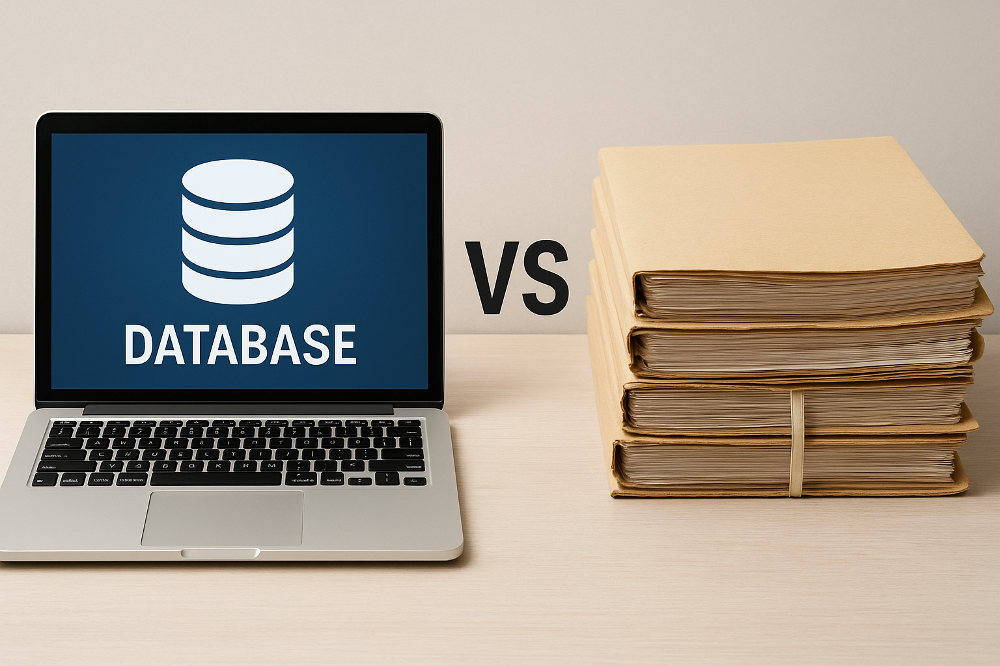

## Was ist eigentlich eine Datenbank?

Stell dir vor, du möchtest alle Infromationen zu Schülerinnen und Schüler einer Schule speichern. Du könntest diese Infos auf Papier schreiben und abheften – oder digital speichern. Genau das machen Datenbanken: Sie speichern, ordnen und verwalten Daten, damit wir sie schnell wiederfinden und nutzen können.

**Reflexion:**
- Wo begegnen dir im Alltag Datenbanken? (z. B. Bibliothek, Streaming, Online-Shops)
- Welche Vorteile hat es, Daten digital statt analog zu speichern?

---

## Definition: Datenbasis vs. Datenbankmanagementsystem (DBMS)

- **Datenbasis:** eine Menge von Daten, die in einem bestimmten Zusammenhang oder für einen bestimmten Zweck erhoben oder verwaltet werden.
- **Datenbankmanagementsystem:** ein Programm, das die Daten verwaltet (z. B. eine Software, die Suchfunktionen bietet).

**Frage:**
- Kannst du den Unterschied mit eigenen Worten erklären?

---

## Übung: Digital vs. Analog

Arbeite mit einer Partnerin oder einem Partner:
- Notiert mindestens zwei Vorteile und zwei Nachteile von digitalen und analogen Daten.
- Tauscht euch kurz aus und besprecht eure Ergebnisse.

**Beispiel:**
- Digital: +Schnelle Suche, +Platzsparend, –Abhängig von Technik, –Datenschutz
- Analog: +Unabhängig von Strom, +Einfach zu verstehen, –Langsame Suche, –Viel Platz nötig

**Reflexion:**
- Welche Variante findest du für die Schule sinnvoller? Warum?
